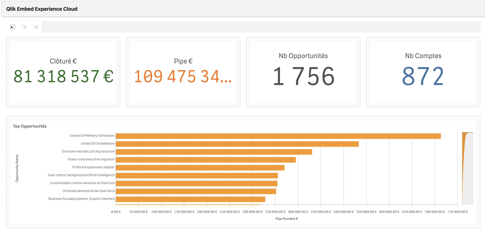

# Qlik Embed Salesforce Experience Cloud

[🇫🇷 Version française disponible ici](README.md)

This project enables the integration of Qlik Cloud components into Salesforce Experience Cloud using Lightning Web Components (LWC) and Visualforce pages.



## 🎯 Overview

This project solves the integration challenges between Qlik Cloud and Salesforce, including:
- Content Security Policy (CSP) conflicts
- WebAuthn errors
- Secure integration of Qlik components
- OAuth2 authentication management

## 🏗️ Project Architecture

### Main Components

1. **`qlikEmbed` LWC** - Reusable Lightning Web Component
2. **`qlikEmbedEnigma` LWC** - Advanced LWC component with Enigma.js for Qlik Cloud integration
3. **`qlikEmbedPage`** - Visualforce test page with Qlik integration
4. **`oauthCallback`** - OAuth callback page for authentication
5. **`qlikEmbedPageAuth`** - Qlik authentication page
6. **`QlikAuthService` Apex** - Apex service for Auth0 SSO authentication

### File Structure

```
force-app/main/default/
├── lwc/
│   ├── qlikEmbed/
│   │   ├── qlikEmbed.js          # Component logic
│   │   ├── qlikEmbed.html        # HTML template
│   │   ├── qlikEmbed.css         # CSS styles
│   │   └── qlikEmbed.js-meta.xml # LWC metadata
│   └── qlikEmbedEnigma/
│       ├── qlikEmbedEnigma.js    # Enigma.js logic
│       ├── qlikEmbedEnigma.html  # HTML template
│       ├── qlikEmbedEnigma.css   # CSS styles
│       └── qlikEmbedEnigma.js-meta.xml # LWC metadata
├── classes/
│   ├── QlikAuthService.cls       # Apex service for Auth0 SSO
│   └── QlikAuthService.cls-meta.xml
├── pages/
│   ├── qlikEmbedPage.page        # Main test page
│   ├── qlikEmbedPage.page-meta.xml
│   ├── oauthCallback.page        # OAuth callback page
│   ├── oauthCallback.page-meta.xml
│   ├── qlikEmbedPageAuth.page    # Authentication page
│   └── qlikEmbedPageAuth.page-meta.xml
└── flexipages/
    └── qlikEmbedTest.flexipage-meta.xml # Lightning test page
```

## 🚀 Installation and Deployment

### Prerequisites

- Salesforce CLI (sf) installed
- Access to a Salesforce Experience Cloud org
- Qlik Cloud account with Web Integration ID

### Deployment Steps

1. **Clone the project**
   ```bash
   git clone <repository-url>
   cd "Salesforce - Experience cloud"
   ```

2. **Salesforce authentication**
   ```bash
   sf org login web --set-default-dev-hub
   ```

3. **Deploy Apex classes**
   ```bash
   sf project deploy start --source-dir force-app/main/default/classes --target-org <your-org-alias>
   ```

4. **Deploy LWC components**
   ```bash
   sf project deploy start --source-dir force-app/main/default/lwc --target-org <your-org-alias>
   ```

5. **Deploy Visualforce pages**
   ```bash
   sf project deploy start --source-dir force-app/main/default/pages --target-org <your-org-alias>
   ```

6. **Deploy Lightning pages**
   ```bash
   sf project deploy start --source-dir force-app/main/default/flexipages --target-org <your-org-alias>
   ```

## ⚙️ Configuration

### Qlik Cloud Configuration

Each component requires the following configuration:

```javascript
// Configuration in Visualforce pages
<script 
    type="text/javascript" 
    src="https://cdn.jsdelivr.net/npm/@qlik/embed-web-components@1/dist/index.min.js"
    data-host="https://your-instance.qlikcloud.com"
    data-web-integration-id="YOUR_WEB_INTEGRATION_ID"
    data-cross-site-cookies="true">
</script>
```

### Environment Variables

- `QLIK_HOST` - URL of your Qlik Cloud instance
- `QLIK_WEB_INTEGRATION_ID` - Qlik web integration ID
- `QLIK_CLIENT_ID` - Qlik Cloud auth CLIENT_ID
- `QLIK_APP_ID` - Qlik application ID
- `QLIK_OBJECT_ID` - Qlik object ID to display

## 🔧 Usage

### LWC Component qlikEmbed

```html
<!-- In a Lightning page -->
<c:qlikEmbed 
    app-id="your-app-id"
    object-id="your-object-id"
    ui="analytics/chart">
</c:qlikEmbed>
```

### LWC Component qlikEmbedEnigma

Advanced component using Enigma.js for Qlik Cloud integration with Auth0 SSO support:

```html
<!-- In Experience Builder -->
<c:qlikEmbedEnigma
    tenant="veg-eu.eu.qlikcloud.com"
    app-id="your-app-id"
    object-ids="htaMkv,YGN"
    auth-type="oauth2"
    client-id="your-auth0-client-id">
</c:qlikEmbedEnigma>
```

**Main properties:**
- `authType`: `'webIntegration'` (default) or `'oauth2'` for Auth0 SSO
- `objectIds`: Comma-separated list of Qlik object IDs
- `showStatus`: Display status messages (default: `false`)

**Features:**
- Transparent authentication via Web Integration ID
- Auth0 SSO support via `QlikAuthService` Apex class
- Dynamic display of KPIs, tables, and lists
- Automatic error handling and redirects

### Visualforce Page

```html
<!-- Direct Qlik component -->
<qlik-embed
    ui="analytics/chart"
    app-id="your-app-id"
    object-id="your-object-id">
</qlik-embed>
```

### OAuth Callback Page

The callback URL must be configured in Qlik Cloud:
```
https://your-org.my.salesforce.com/apex/oauthCallback
```

### Apex Class QlikAuthService

Apex service for Auth0 SSO authentication with Qlik Cloud:

```apex
// Main method
String token = QlikAuthService.getQlikAccessToken(tenant, clientId, redirectUri);
```

**Features:**
- Retrieves Salesforce user identity (Email, Username, FederationIdentifier)
- Exchanges Salesforce identity for Qlik Cloud token via Auth0
- Supports Named Credential for Auth0 configuration

**Required configuration:**
- Auth0 configured to accept Salesforce identities
- Qlik Cloud configured to accept Auth0 tokens
- (Optional) Named Credential "Auth0" configured in Salesforce

## 🛠️ Troubleshooting

### CSP (Content Security Policy) Errors

**Problem**: External or inline scripts blocked
**Solution**: Use Visualforce pages with `data-*` attribute configuration

### WebAuthn Errors

**Problem**: Conflicts with browser WebAuthn API
**Solution**: Temporarily disable `navigator.credentials` during loading

### Module Errors

**Problem**: `No MODULE named markup://qlik:embed found`
**Solution**: Dynamically create `<qlik-embed>` elements via JavaScript

## 📱 Testing and Validation

### Test URLs

1. **Main page**: `/apex/qlikEmbedPage`
2. **Authentication page**: `/apex/qlikEmbedPageAuth`
3. **Multi-components page**: `/apex/qlikEmbedPageMulti`
4. **OAuth callback**: `/apex/oauthCallback`
5. **Lightning page**: Use Lightning App Builder

### Verifications

- Browser console without errors
- Qlik component visible and functional
- OAuth authentication working
- No CSP violations

## 📸 Screenshots

### **Main Qlik Embed Page**


### **Multi-components Page**


### **LWC Component in Lightning**


### **OAuth Callback Page**


## 🔒 Security

### Best Practices

- Use HTTPS for all communications
- Validate OAuth parameters
- Secure token management
- Respect Salesforce CSP policies

### Authentication

- OAuth2 with Qlik Cloud
- Secure redirect handling
- OAuth state validation
- Authentication error handling

## 📚 Resources

### Official Documentation

- [Salesforce LWC Documentation](https://developer.salesforce.com/docs/component-library/documentation/lwc)
- [Qlik Embed Web Components](https://qlik.dev/apis/embed-web-components/)
- [Salesforce Visualforce](https://developer.salesforce.com/docs/atlas.en-us.pages.meta/pages/pages_intro.htm)

### Development Tools

- Salesforce CLI
- Salesforce Developer Console
- Lightning App Builder
- Qlik Cloud Console

## 🤝 Contributing

### How to Contribute

1. Fork the project
2. Create a feature branch (`git checkout -b feature/AmazingFeature`)
3. Commit your changes (`git commit -m 'Add some AmazingFeature'`)
4. Push to the branch (`git push origin feature/AmazingFeature`)
5. Open a Pull Request

### Code Standards

- Follow Salesforce conventions
- Comment complex code
- Test before deploying
- Document new features

## 📄 License

This project is licensed under the MIT License. See the [LICENSE](LICENSE) file for details.

## 📞 Support

For any questions or issues:

- Create an issue on GitHub
- Consult Salesforce documentation
- Contact the development team

## 🔄 Versions

### v1.1.0 (Current)
- `qlikEmbedEnigma` LWC component with Enigma.js
- `QlikAuthService` Apex class for Auth0 SSO
- OAuth2/Auth0 authentication support
- Dynamic display of KPIs, tables, and lists
- Experience Cloud sandboxed iframe handling

### v1.0.0
- qlikEmbed LWC component
- Visualforce test pages
- OAuth callback handling
- WebAuthn conflict resolution
- Salesforce CSP support

### Roadmap
- [ ] Custom theme support
- [ ] Advanced error handling
- [ ] Automated testing
- [ ] API documentation
- [ ] Usage examples

---

**Note**: This project is maintained by [Magik Cypress](https://github.com/magikcypress). For updates and support, regularly consult this README.
